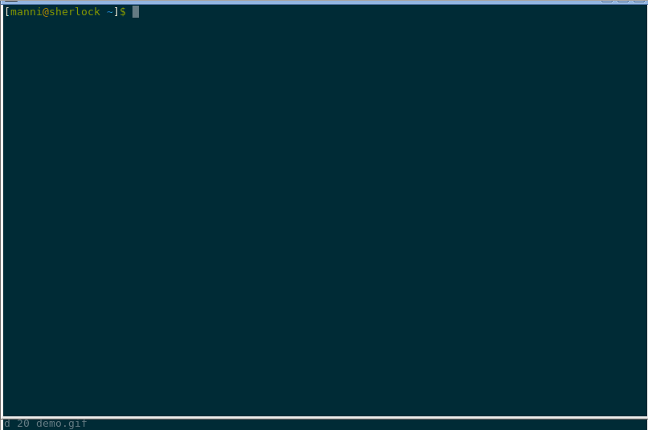

# vispat

Vim Server In A Tmux Pane

## Why?

Because vsiatp (Vim Server In A Tmux Pane)
is so hard to pronounce.

If you are using `tmux` and you like to split your windows into panes
so that, for example, you have a shell running in the left pane and
a `vim` instance in the right plane, vispat will allow you to open a
file in the already running `vim` on the right.

## Requirements

- Of course you need `tmux`
- You need a version of `vim` that was compiled with server support.
  Depending on your environment, you will have to find the correct
  vim-package to install. E.g., on Fedora you need to install `vim-X11`.
- To be able to load Perl modules by their package name, install
  `Module::Path`

## Installation

    cd somedir
    git clone https://github.com/mannih/vispat.git

And in your .bashrc, add the line

    source somedir/vispat/vispat.sh

## Usage

vispat gives you a couple of bash functions to use from the command
line:

- `ws`

Create a vertical split and start `vim` in the right pane.

- `select_vim_pane` (aliased to `vp`)

Activate the `tmux` pane that contains the `vim` instance.

- `v`

Takes one or more file names as arguments and opens those files in the
vim instance that can be found in some pane of your current tmux window.
If no running vim instance can be found, a new one will be started.

## Configuration

Configuration is optional, but you might want to read on if you are
developing in Perl or like to use `vim`'s tab feature.

### Perl module support

    export vispat_for_perl=1

If you want to be able to edit perl modules by package name:

    v IO::All

will then find the file implementing `IO::All` (you will have to install
`Module::Path` for this to work). Also:

    v Moo

This works detecting two colons or by matching arguments that start with
a capital letter and do not contain a dot.

### vim tab support

    export vispat_use_tabs=1

If you prefer using `vim`'s tabs feature. Every file you load with v will then
open in a new tab.

